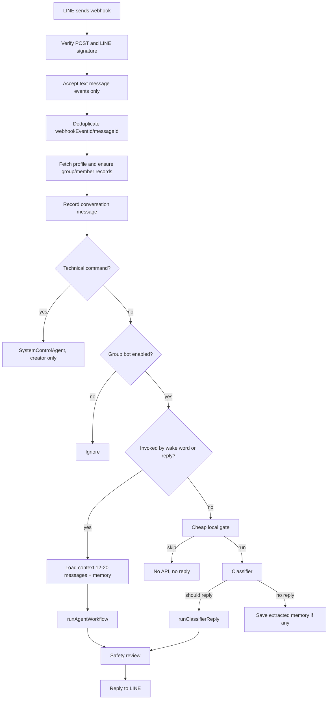

# Harnkan / Wimol AI Project Context

เอกสารนี้ใช้ส่งต่องานให้ Codex เครื่องอื่นหรือ thread ใหม่ เพื่อเข้าใจโครงสร้างโปรเจกต์และแก้ไขต่อได้โดยไม่ต้องไล่บทสนทนาเดิมทั้งหมด

## Project

- ชื่อเว็บ: หารกัน / Harnkan
- GitHub repo: https://github.com/givemeaiedit-arch/harnkan
- Firebase project: `givemeai-gpt-hub`
- Firebase Hosting: https://harnkan-givemeai-gpt-hub.web.app/
- GitHub Pages: https://givemeaiedit-arch.github.io/harnkan/
- Workspace เดิม: `D:\web หารกัน`

## Important Rule

- ห้ามลบหรือ deploy ทับ Firebase Functions อื่นที่ไม่เกี่ยวข้อง
- ถ้าแก้ LINE OA bot ให้ deploy เฉพาะ:

```powershell
pnpm --dir functions run build
pnpm dlx firebase-tools deploy --only functions:lineWebhook --project givemeai-gpt-hub
```

- ถ้าแก้หน้าเว็บหรือ dashboard ให้ deploy hosting:

```powershell
firebase deploy --only hosting:harnkan --project givemeai-gpt-hub
```

- ห้าม commit ไฟล์ข้อมูลส่วนตัว เช่น `.env.local`, `data.json`, `line_config.json`, `line_events.json`, รูป mockup, หรือไฟล์ `.txt` ที่ไม่เกี่ยวข้อง
- มีไฟล์ untracked ที่เคยเห็น: `New Text Document.txt` อย่า add ถ้าไม่ได้ตั้งใจ

## Main Files

- `index.html` - หน้าเว็บหลัก, dashboard, LINE OA webhook UI
- `styles.css` - style ทั้งเว็บและ dashboard
- `app.js` - logic หน้าเว็บหารกันและ dashboard ฝั่ง browser
- `firebase.json` - Firebase Hosting rewrites และ Functions config
- `functions/src/index.ts` - Firebase Functions entrypoints, LINE webhook router, system commands
- `functions/src/agents.ts` - AI workflow, classifier, persona, agents, OpenAI calls, cost estimate
- `functions/src/repository.ts` - Firestore repository, memory, events, analytics, audit
- `functions/src/line.ts` - LINE signature/profile/reply helpers
- `functions/src/types.ts` - shared types

## Firebase Functions

Functions ที่เกี่ยวกับ Harnkan / Wimol:

- `lineWebhook` - LINE OA webhook หลัก
- `lineConfig` - config/model/status endpoint
- `lineEvents` - dashboard/event panel endpoint
- `aiGroupMemory` - admin memory endpoint

โปรเจกต์ Firebase เดียวกันมี functions อื่นของงานอื่น เช่น ad check, topup, telegram ห้ามแตะถ้าไม่ได้รับคำสั่งชัดเจน

## Secrets

Secrets อยู่ใน Firebase Secret Manager:

- `LINE_CHANNEL_SECRET`
- `LINE_CHANNEL_ACCESS_TOKEN`
- `OPENAI_API_KEY`

ไม่ควรใส่ secret ลง repo หรือส่งเป็น plaintext ในเอกสารนี้

## Wimol AI Overview

วิมลคือ AI bot ใน LINE group ที่:

- ตอบเมื่อมีคำว่า `วิมล`, `@วิมล`, `AI`, หรือมีคนกด reply ข้อความของวิมล
- มี classifier สำหรับประเมินข้อความที่ไม่ได้เรียกชื่อ ว่าควรตอบหรือควรจำแบบเงียบ ๆ ไหม
- เห็น context ย้อนหลังของกลุ่ม
- เก็บ memory รายบุคคลและ memory กลุ่มใน Firestore
- มี dashboard ดู event, memory, cost, model, route, agent
- มี system command เฉพาะผู้สร้าง

ผู้สร้างปัจจุบัน:

- Display: `Notzio PK`
- Creator ID hash: `733b9dbc996a`

## LINE Webhook Flow



## Trigger Rules

วิมลตอบเมื่อ:

- ข้อความมี `วิมล`
- ข้อความมี `@วิมล`
- ข้อความมี `AI`
- ผู้ใช้กด reply ข้อความที่วิมลเคยส่ง
- เป็น system command เช่น `วิมล เปิดระบบ`
- classifier เห็นว่าข้อความธรรมดาน่าตอบจริง ๆ

โหมดสุ่มแทรกความเห็น 10-30% ถูกถอดออกแล้ว ใช้ gate/classifier แทน

## System Commands

ใช้ได้เฉพาะ creator hash `733b9dbc996a`

- `วิมล เปิดระบบ`
- `วิมล ปิดระบบ`
- `วิมล System status`
- `วิมล System cost`
- `วิมล System model`
- `วิมล System model gpt-5.4-mini`
- `วิมล System memory check [ข้อความ]`
- `วิมล System memory delete 1`
- `วิมล System memory edit 1 [ข้อความใหม่]`

Memory selector รองรับ:

- เลขลำดับจากผล check ล่าสุด เช่น `1`
- memory id เต็ม
- memory id prefix ถ้าตรงรายการเดียว

หมวด memory ที่ใช้ได้:

- `profile`
- `food`
- `birthday`
- `preference`
- `split`
- `note`

ตัวอย่าง:

```text
วิมล System memory check เบียร์
วิมล System memory edit 1 โอชิไม่กินเบียร์ category=food
วิมล System memory delete 1
```

## Memory Model

Memory มี 2 ระดับหลัก:

1. Group memory collection:

```text
lineGroups/{groupId}/memories/{memoryId}
```

2. Member memory subcollection:

```text
lineGroups/{groupId}/members/{userId}/memories/{memoryId}
```

เมื่อ save memory จะอัปเดต `profileSummary` ของ member ด้วย เพื่อให้ prompt โหลดข้อมูลสำคัญเร็วขึ้น

Memory fields:

- `ownerUserId`
- `category`
- `text`
- `confidence`
- `createdAt`
- `updatedAt`

## Conversation Context

ทุกข้อความ text ที่ผ่าน webhook จะถูกบันทึกเป็น conversation ก่อนเสมอ:

```text
lineGroups/{groupId}/messages/{messageId}
```

ข้อมูลนี้ใช้เป็น context ย้อนหลัง แต่ยังไม่ใช่ memory ระยะยาว

เวลาเรียกวิมล:

- mention/wake word ใช้ context ประมาณ 12 ข้อความล่าสุด
- reply ข้อความวิมลใช้ context ประมาณ 20 ข้อความล่าสุด
- classifier ใช้ context ประมาณ 10 ข้อความล่าสุด

`getGroupContext()` โหลด:

- current user profile
- members
- recent messages
- speaker memories
- related members
- related memories
- group memories
- recent memories

## Memory Save Timing

ระบบบันทึก memory ระยะยาวใน 3 กรณี:

1. ผู้ใช้สั่งจำโดยตรง เช่น `วิมล จำว่า...`
2. ข้อความที่เรียกวิมลมี keyword น่าจำ เช่น ชื่อ, วันเกิด, ชอบ, ไม่ชอบ, ไม่กิน, แพ้, หาร, โอน, จ่าย
3. ข้อความไม่ได้เรียกวิมล แต่ผ่าน cheap gate และ classifier สกัด memory ได้

Memory จะถูก save เฉพาะเมื่อ:

- confidence >= `0.72`
- ไม่ใช่ข้อมูล sensitive
- จำกัดไม่เกิน 3 รายการต่อรอบ

Sensitive ที่ไม่ควรจำ:

- password
- API key
- token
- secret
- channel secret
- access token
- เลขบัตร
- เลขบัญชี
- ข้อมูลสุขภาพละเอียด

## Classifier

Classifier ใช้เมื่อข้อความไม่ได้เรียกวิมล แต่ cheap gate เห็นว่าน่าประมวลผล

หน้าที่:

- ตัดสินใจว่าควรตอบไหม
- เลือก intent/tasks
- เลือก personality mode
- เลือก reply intent
- สกัด memory ที่ควรจำ

ถ้า confidence ต่ำกว่า `0.62` จะไม่ตอบ

Classifier model default:

```text
gpt-4.1-nano
```

## Agents

Agent routes:

- `dynamic`
- `mixed`
- `general`
- `memory`
- `memory_show`
- `memory_delete`
- `split`
- `horoscope`
- `speech`

Agent names ที่พบใน dashboard:

- `WimolDynamicAgent`
- `SystemControlAgent`
- `MessageClassifier`
- `RuleGate`
- `DeduplicationGate`
- `SafetyReviewAgent`

`runAgentWorkflow()` จะเลือก agent ตาม route และ intent แล้วผ่าน `safetyReview()` ก่อนส่ง LINE

## Persona

วิมลถูกตั้งให้:

- เป็นผู้หญิง
- เป็นเพื่อนในกลุ่ม ไม่ใช่ผู้ช่วยทางการ
- กวน ฉลาด แซวไว อบอุ่น ไม่แรง
- แทนตัวเองว่า `วิมล`
- ใช้ `ค่ะ` / `นะคะ`
- ห้ามใช้ `ผม` / `ครับ`
- ตอบสั้น 1-3 บรรทัด
- ห้ามเปิดเผยข้อมูลส่วนตัวหรือ secret

มี `feminizeReply()` แก้คำลงท้ายบางส่วนก่อนส่ง

## Cost / Model

Model options:

- `GPT 5.4 mini` -> `gpt-5.4-mini`
- `GPT 4o1 mini` -> `gpt-4.1-mini`

ค่าใช้จ่ายคำนวณจาก:

- input tokens
- output tokens
- model rate
- USD to THB default: `32.9`

Dashboard แสดง:

- calls
- tokens
- estimated USD
- estimated THB
- model
- route
- agent
- status

## Dashboard / Event Panel

Endpoints:

- `/api/line/config`
- `/api/line/events`
- `/api/ai/groups/:groupId/memory`

ข้อมูล event มาจาก `recordAudit()`

Audit fields สำคัญ:

- `messagePreview`
- `trigger`
- `route`
- `agent`
- `status`
- `latencyMs`
- `model`
- `inputTokens`
- `outputTokens`
- `totalTokens`
- `estimatedUsd`
- `estimatedThb`
- `lineReplyStatus`
- `lineReplyOk`
- `lineReplyError`
- `classifierReason`
- `classifierConfidence`
- `intent`
- `tasks`
- `decisionReason`
- `memoryUsedCount`
- `contextUsedCount`
- `savedMemoryCount`

## Current Design Direction

แนวทางรอบถัดไปที่วางไว้:

1. ปรับ memory ให้แม่นขึ้นโดยใช้ local retrieval ก่อนเรียก AI
2. เพิ่ม keyword/alias/scope/importance/useCount ให้ memory
3. แยก memory รายบุคคลและ group entity memory
4. เพิ่ม Group Memory Graph สำหรับ:
   - บุคคลที่ 3
   - สัตว์
   - สิ่งของ
   - สถานที่
   - ร้านค้า
   - event
   - project
   - inside joke
   - rule
   - other
5. ลด token โดยส่งเฉพาะ memory ที่เกี่ยวข้องเข้า prompt

## Proposed Group Entity Memory

ควรเพิ่ม collection:

```text
lineGroups/{groupId}/entities/{entityId}
lineGroups/{groupId}/entityAliases/{aliasKey}
```

Entity type:

```ts
type GroupEntityType =
  | "third_person"
  | "animal"
  | "object"
  | "place"
  | "shop"
  | "event"
  | "project"
  | "inside_joke"
  | "rule"
  | "other";
```

Entity fields ที่แนะนำ:

- `type`
- `name`
- `aliases`
- `keywords`
- `summary`
- `importance`
- `confidence`
- `mentionCount`
- `lastMentionedAt`

Entity memory fields ที่แนะนำ:

- `scope: "group"`
- `ownerType: "entity"`
- `entityId`
- `entityType`
- `category`
- `text`
- `keywords`
- `aliases`
- `importance`
- `confidence`
- `sourceUserIdHash`
- `sourceMessageId`

## Recommended Next Implementation

เพิ่ม functions ใน `repository.ts`:

```ts
detectLocalEntities()
upsertGroupEntity()
saveEntityMemory()
retrieveGroupEntityMemories()
mergeGroupEntities()
retrieveRelevantMemories()
```

ปรับ `getGroupContext()` ให้คืน:

```ts
relatedEntities
entityMemories
retrievedMemories
```

ปรับ `conversationContextSummary()` ให้ส่ง memory แบบคัดแล้ว:

- speaker memories top 5
- mentioned person memories top 5 ต่อคน
- related group/entity memories top 10
- recent context 10-20 ข้อความ

เป้าหมาย:

- จำคน สถานที่ สิ่งของ และมุกกลุ่มได้แม่นขึ้น
- ลด token 40-70% โดยไม่ลดคุณภาพ
- ลด classifier calls ที่ไม่จำเป็น

## Development Checklist

ก่อนแก้:

```powershell
git status --short
pnpm --dir functions run build
```

หลังแก้ backend:

```powershell
pnpm --dir functions run build
pnpm dlx firebase-tools deploy --only functions:lineWebhook --project givemeai-gpt-hub
```

หลังแก้ hosting/dashboard:

```powershell
firebase deploy --only hosting:harnkan --project givemeai-gpt-hub
```

หลัง deploy:

```powershell
git add <changed files>
git commit -m "<message>"
git push
```

ตรวจท้ายสุด:

```powershell
git status --short
```

